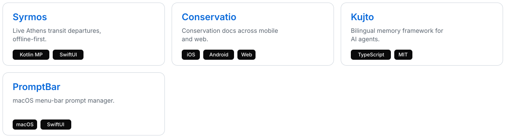

<picture>
  <source media="(max-width: 640px)" srcset="./assets/hero-mobile.svg">
  
</picture>

 

 
 

 

### Now

- **iOS Engineer at [Plum Fintech](https://withplum.com)** — user-facing fintech features in Swift, SwiftUI, UIKit, and TCA.
- **Building in parallel** — [Syrmos](https://syrmos.peterdsp.dev), [Conservatio](https://conservatio.peterdsp.dev), [Kujto](https://kujto.peterdsp.dev), and smaller Apple-platform tools.
- **Athens, Greece** — focused on reliability, clean architecture, and release polish.

### Selected work

<a href="https://syrmos.peterdsp.dev">Syrmos</a> &middot; <a href="https://github.com/peterdsp/Syrmos">repo</a> &nbsp;&bull;&nbsp;
<a href="https://conservatio.peterdsp.dev">Conservatio</a> &middot; <a href="https://github.com/peterdsp/conservatio">repo</a> &nbsp;&bull;&nbsp;
<a href="https://kujto.peterdsp.dev">Kujto</a> &middot; <a href="https://github.com/peterdsp/kujto">repo</a> &nbsp;&bull;&nbsp;
<a href="https://github.com/peterdsp/PromptBar">PromptBar</a> &nbsp;&bull;&nbsp;
<a href="https://klipa.peterdsp.dev">Klipa</a> &middot; <a href="https://github.com/peterdsp/klipa">repo</a> &nbsp;&bull;&nbsp;
<a href="https://github.com/peterdsp/glint">Glint</a>

### Toolbox

### Open-source signal

<picture>
  <source media="(max-width: 640px)" srcset="./assets/stars-mobile.svg">
  
</picture>

 
 

<picture>
  <source media="(prefers-color-scheme: dark)" srcset="https://raw.githubusercontent.com/peterdsp/peterdsp/output/snake.svg">
  <source media="(prefers-color-scheme: light)" srcset="https://raw.githubusercontent.com/peterdsp/peterdsp/output/snake-light.svg">
  
</picture>

### Recognition & education

<table>
  <tr>
    <td width="50%" valign="top">

**Recognition**

- **LocAbility** — Top 20 of 120, Apps4Athens Hackathon 2.0 (City of Athens, 2025).
- **CoNeCo 2024**, Copenhagen — thesis on a human-centred stress and anxiety app, among 37 standout submissions.

</td>
    <td width="50%" valign="top">

**Education**

- **MEng, Informatics & Computer Engineering** — University of West Attica
- **Diploma, Advanced Software Engineering** — University of York
- **iOS Development** — London App Brewery & Meta

</td>
  </tr>
</table>

Swift &middot; SwiftUI &middot; UIKit &middot; TCA &middot; Kotlin Multiplatform &middot; release quality

