<picture>
  <source media="(max-width: 640px)" srcset="./assets/hero-mobile.svg">
  
</picture>

 

 
 

 

<picture>
  
</picture>

 

### Now

- **iOS Engineer at [Plum Fintech](https://withplum.com)**, Engagement Team. Shipping user-facing fintech features with Swift, SwiftUI, UIKit, and TCA.
- **Building in parallel:** [Syrmos](https://syrmos.peterdsp.dev), [Conservatio](https://conservatio.peterdsp.dev), [Kujto](https://kujto.peterdsp.dev), and smaller Apple-platform tools.
- **Based in Athens, Greece.** Product-minded Apple-platform engineer with a bias for reliability, clear architecture, and polished release quality.

### Selected work

<table>
  <tr>
    <td width="50%" valign="top">
      <h3><a href="https://syrmos.peterdsp.dev">Syrmos</a></h3>
      
Live Athens metro, tram, and suburban railway departures. Offline-first, fast underground, and built for daily commuting.

      

        
        
        
      

      
<a href="https://syrmos.peterdsp.dev">Website</a> &middot; <a href="https://github.com/peterdsp/Syrmos">Repository</a>

    </td>
    <td width="50%" valign="top">
      <h3><a href="https://conservatio.peterdsp.dev">Conservatio</a></h3>
      
Professional conservation documentation platform for cultural-heritage practitioners across mobile and web workflows.

      

        
        
        
      

      
<a href="https://conservatio.peterdsp.dev">Website</a> &middot; <a href="https://github.com/peterdsp/conservatio">Repository</a>

    </td>
  </tr>
  <tr>
    <td width="50%" valign="top">
      <h3><a href="https://kujto.peterdsp.dev">Kujto</a></h3>
      
Open-source bilingual memory framework for AI coding agents. Git-native rules, workflows, and project knowledge.

      

        
        
        
      

      
<a href="https://kujto.peterdsp.dev">Website</a> &middot; <a href="https://github.com/peterdsp/kujto">Repository</a>

    </td>
    <td width="50%" valign="top">
      <h3><a href="https://github.com/peterdsp/gjuha">Gjuha</a></h3>
      
Albanian language learning app with an offline-first curriculum engine and SwiftUI plus TCA product architecture.

      

        
        
        
      

      
<a href="https://github.com/peterdsp/gjuha">Repository</a>

    </td>
  </tr>
  <tr>
    <td width="50%" valign="top">
      <h3><a href="https://github.com/peterdsp/PromptBar">PromptBar</a></h3>
      
macOS menu-bar prompt manager for fast LLM workflows, built to keep repeated prompting close to the keyboard.

      

        
        
        
      

      
<a href="https://github.com/peterdsp/PromptBar">Repository</a>

    </td>
    <td width="50%" valign="top">
      <h3><a href="https://github.com/peterdsp/imjaDNS">imjaDNS</a></h3>
      
Cross-platform SwiftUI DNS-over-HTTPS configurator for iPhone, iPad, and Mac, built with Composable Architecture.

      

        
        
        
      

      
<a href="https://github.com/peterdsp/imjaDNS">Repository</a>

    </td>
  </tr>
</table>

### Toolbox

### Commit grid &middot; 3D snake

<picture>
  <source media="(prefers-color-scheme: dark)" srcset="https://raw.githubusercontent.com/peterdsp/peterdsp/output/snake.svg">
  <source media="(prefers-color-scheme: light)" srcset="https://raw.githubusercontent.com/peterdsp/peterdsp/output/snake-light.svg">
  
</picture>

### Open source signal

<picture>
  <source media="(max-width: 640px)" srcset="./assets/stars-mobile.svg">
  
</picture>

 
 

 
 

### Recognition and background

<table>
  <tr>
    <td width="50%" valign="top">

**Recognition**

- **LocAbility**, Apps4Athens Hackathon 2.0, City of Athens, 2025. Selected among the Top 20 of 120 projects for accessibility and mobility.
- **CoNeCo 2024**, Copenhagen. Thesis on a human-centred mobile app for managing stress and anxiety, honored among 37 standout submissions.

</td>
    <td width="50%" valign="top">

**Education**

- **MEng, Informatics and Computer Engineering**, University of West Attica
- **Diploma, Advanced Software Engineering**, University of York
- **iOS Development**, London App Brewery and Meta

</td>
  </tr>
</table>

Swift &middot; SwiftUI &middot; UIKit &middot; TCA &middot; Kotlin Multiplatform &middot; release quality &middot; architecture under pressure

